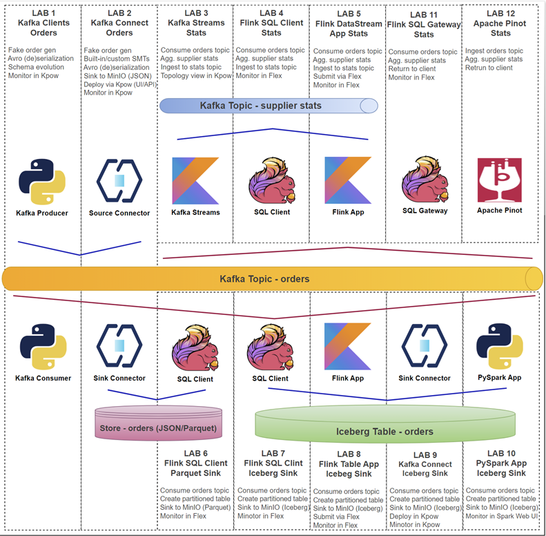
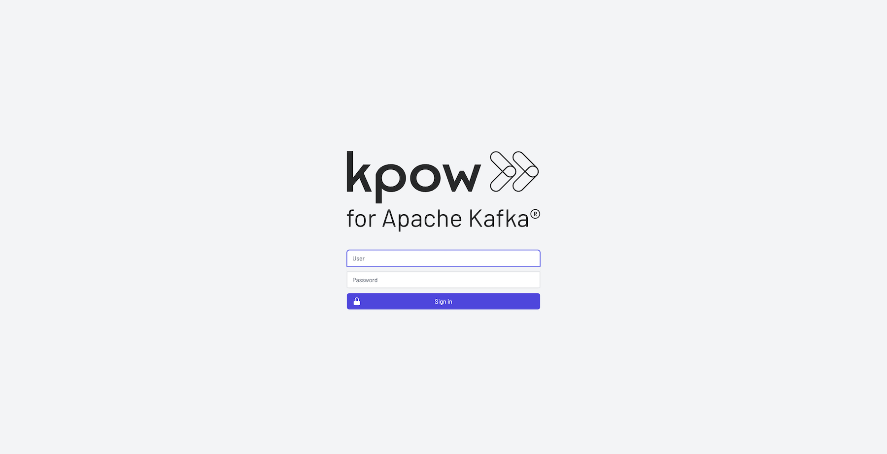
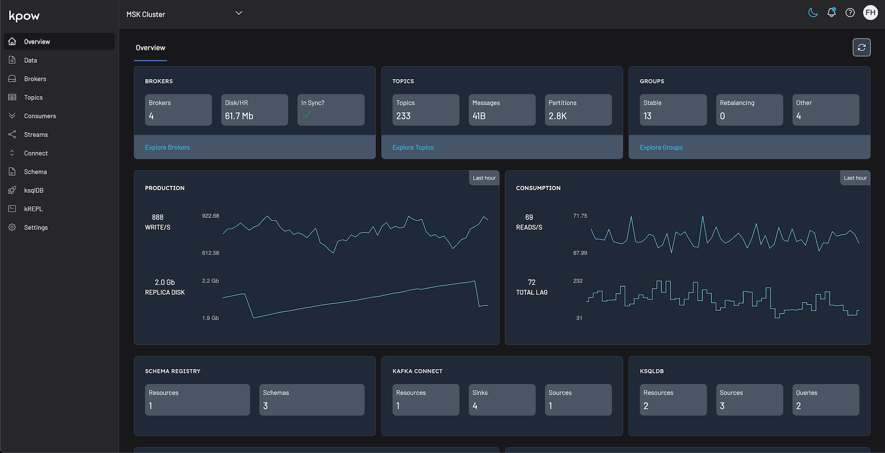

# Factor House Local


## Introduction

We provide several pre-configured Docker Compose environments to showcase different data platform setups. The summaries below offer a quick overview of each:

<details>

<summary><b>Kafka Development & Monitoring with Kpow</b></summary>

<br>

This stack provides a complete **Apache Kafka development and monitoring environment**, built using Confluent Platform components and enhanced with [**Kpow**](https://factorhouse.io/kpow) for enterprise-grade observability and management. It includes a 3-node Kafka cluster, Zookeeper, Schema Registry, Kafka Connect, and Kpow itself.

### 📌 Description

This architecture is designed for developers and operations teams who need a **robust, local Kafka ecosystem** for building, testing, and managing Kafka-based applications. It features high availability (3 brokers), schema management for data governance, a data integration framework (Kafka Connect), and a powerful UI (Kpow) for monitoring cluster health, inspecting data, managing topics, and troubleshooting.

It's ideal for scenarios involving **event-driven architectures, microservices communication, data integration pipelines**, and situations requiring deep visibility into Kafka internals.

---

### 🔑 Key Components

#### 🚀 Kpow (Kafka Management & Monitoring Toolkit)

- Container: **kpow** from (`factorhouse/kpow:latest` (**enterprise**)) or **kpow-ce** from (`factorhouse/kpow-ce:latest` (**community**))
- An engineering toolkit providing a rich web UI for comprehensive Kafka monitoring, management, and data inspection. Kpow gathers Kafka resource information, stores it locally in internal topics, and delivers custom telemetry and insights. Features include:
  - **Comprehensive Real-time Kafka Resource Monitoring:**
    - Instant visibility ("X-Ray vision") of brokers, topics, consumer groups, partitions, offsets, and more.
    - Gathers data every minute, with a "Live mode" for real-time updates.
    - No JMX access required.
  - **Advanced Consumer and Streams Monitoring (Compute Console):**
    - Visualize message throughput and lag for consumers (and soon, Kafka Streams topologies).
    - Multi-dimensional consumer lag insights from custom derived telemetry.
    - Ability to reset consumption at group, host, member, topic, or assignment level.
  - **Deep Data Inspection with kJQ:**
    - Powerful JQ-like querying (kJQ) to search tens of thousands of messages per second.
    - Supports JSON, Apache Avro®, Transit, EDN, and Protobuf messages (with custom serdes for Protobuf to JSON).
  - **Schema Registry Integration:** Full support for controlling and monitoring Schema Registries.
  - **Kafka Connect Cluster Management:** Full support for controlling and monitoring Kafka Connect clusters.
  - **Enterprise-Grade Security & Governance:**
    - **Authentication:** Supports DB, File, LDAP, SAML, or OpenID configurations.
    - **Authorization:** Simple or Role-Based Access Controls (RBAC). The original summary also mentioned JAAS, often paired with RBAC and configured via volume mounts (_Enterprise edition (ee) only_).
    - **Data Policies:** Includes capabilities for masking and redaction of sensitive data (e.g., PII, Credit Card).
    - **Audit Logging:** All user actions are captured in the Kpow audit log.
  - **Key Integrations & Deployment Features:**
    - **Slack Integration:** Sends user actions to an operations channel.
    - **Prometheus Endpoints:** For integration with preferred metrics and alerting systems.
    - **HTTPS Support:** Easily configured with your own certificates or via a reverse-proxy.
    - **Multi-Cluster Monitoring:** Manage multiple Kafka clusters from a single Kpow installation.
    - **Air-Gapped Environments:** Well-suited due to all data being stored in local Kafka topics.
- Exposes UI at `http://localhost:3000`

#### 🧠 Kafka Cluster (3 Brokers + Zookeeper)

- **Zookeeper (`confluentinc/cp-zookeeper:7.8.0`)**: Coordinates the Kafka brokers.
- **Kafka Brokers (`confluentinc/cp-kafka:7.8.0` x3)**: Form the core message bus.
  - Configured with distinct internal (`1909x`) and external (`909x`) listeners for docker networking.
  - Provides basic fault tolerance with 3 nodes.
  - Accessible externally via ports `9092`, `9093`, `9094`.

#### 📜 Schema Registry (`confluentinc/cp-schema-registry:7.8.0`)

- Manages schemas (Avro, Protobuf, JSON Schema) for Kafka topics, ensuring data consistency and enabling schema evolution.
- Accessible at `http://localhost:8081`.
- Configured with Basic Authentication (`schema_jaas.conf`).
- Stores its schemas within the Kafka cluster itself.

#### 🔌 Kafka Connect (`confluentinc/cp-kafka-connect:7.8.0`)

- Framework for reliably streaming data between Apache Kafka and other systems.
- Accessible via REST API at `http://localhost:8083`.
- Configured to use JSON converters by default.
- **Custom Connector Support**: Volume mount `./resources/kpow/connector` allows adding custom or third-party connectors (e.g., JDBC, S3, Iceberg - hinted by `AWS_REGION`).
- Manages its configuration, offsets, and status in dedicated Kafka topics.

---

### 🧰 Use Cases

#### Local Kafka Development & Testing

- Build and test Kafka producers, consumers, and Kafka Streams applications against a realistic, multi-broker cluster.
- Validate application behavior during broker failures (by stopping/starting broker containers).

#### Data Integration Pipelines

- Utilize Kafka Connect to ingest data into Kafka from databases, logs, or APIs using source connectors.
- Stream data out of Kafka to data lakes (S3, Iceberg), warehouses, or other systems using sink connectors.
- Test and manage connector configurations via the Connect REST API or Kpow UI.

#### Schema Management & Evolution

- Define, register, and evolve schemas using Schema Registry to enforce data contracts between producers and consumers.
- Test compatibility modes and prevent breaking changes in data pipelines.

#### Real-Time Monitoring & Operations Simulation

- Use Kpow to monitor cluster health, track topic/partition metrics (size, throughput), identify consumer lag, and inspect messages in real-time.
- Understand Kafka performance characteristics and troubleshoot issues within a controlled environment.

#### Learning & Exploring Kafka

- Provides a self-contained environment to learn Kafka concepts, experiment with configurations, and explore the capabilities of the Confluent Platform and Kpow.

</details>

<details>

<summary><b>Unified Analytics Platform with Flex, Flink, Spark, Iceberg & Hive Metastore</b></summary>

<br>

This stack builds a **comprehensive analytics platform** that erases the line between real-time stream analytics and large-scale batch processing. It achieves this by combining the power of **Apache Flink**, enhanced by [**Flex**](https://factorhouse.io/flex) for enterprise-grade management and monitoring, with **Apache Spark** on a unified data lakehouse, enabling you to work with a single source of truth for all your data workloads.

### 📌 Description

This architecture is designed around a modern data lakehouse that serves both streaming and batch jobs from the same data. At its foundation, data is stored in Apache Iceberg tables on MinIO, an S3-compatible object store. This provides powerful features like ACID transactions, schema evolution, and time travel for your data.

A central **Hive Metastore** serves as a unified metadata catalog for the entire data ecosystem, providing essential information about the structure and location of datasets. By using a robust **PostgreSQL** database as its backend, the metastore reliably tracks all table schemas and metadata. This central catalog allows both **Apache Flink** (for low-latency streaming) and **Apache Spark** (for batch ETL and interactive analytics) to discover, query, and write to the same tables seamlessly, eliminating data silos.

The role of PostgreSQL is twofold: in addition to providing a durable backend for the metastore, it is configured as a high-performance transactional database ready for **Change Data Capture (CDC)**. This design allows you to stream every `INSERT`, `UPDATE`, and `DELETE` from your operational data directly into the lakehouse, keeping it perfectly synchronized in near real-time.

The platform is rounded out by enterprise-grade tooling: **Flex** simplifies Flink management and monitoring, a **Flink SQL Gateway** enables interactive queries on live data streams, and a single node **Spark cluster** supports complex data transformations. This integrated environment is ideal for building sophisticated solutions for fraud detection, operational intelligence, and unified business analytics.

---

### 🔑 Key Components

#### 🚀 Flex (Enterprise Flink Runtime)

- Container: **kpow** from (`factorhouse/flex:latest` (**enterprise**)) or **kpow-ce** from (`factorhouse/flex-ce:latest` (**community**))
- Provides an enterprise-ready tooling solution to streamline and simplify Apache Flink management. It gathers Flink resource information, offering custom telemetry, insights, and a rich data-oriented UI. Key features include:
  - **Comprehensive Flink Monitoring & Insights:**
    - Gathers Flink resource information minute-by-minute.
    - Offers fully integrated metrics and telemetry.
    - Provides access to long-term metrics and aggregated consumption/production data, from cluster-level down to individual job-level details.
  - **Simplified Management for All User Groups:**
    - User-friendly interface and intuitive controls.
    - Aims to align business needs with Flink capabilities.
  - **Enterprise-Grade Security & Governance:**
    - **Versatile Authentication:** Supports DB, File, LDAP, SAML, OpenID, Okta, and Keycloak.
    - **Robust Authorization:** Offers Simple or fine-grained Role-Based Access Controls (RBAC).
    - **Data Policies:** Includes capabilities for masking and redaction of sensitive data (e.g., PII, Credit Card).
    - **Audit Logging:** Captures all user actions for comprehensive data governance.
    - **Secure Deployments:** Supports HTTPS and is designed for air-gapped environments (all data remains local).
  - **Powerful Flink Enhancements:**
    - **Multi-tenancy:** Advanced capabilities to manage Flink resources effectively with control over visibility and usage.
    - **Multi-Cluster Monitoring:** Manage and monitor multiple Flink clusters from a single installation.
  - **Key Integrations:**
    - **Prometheus:** Exposes endpoints for integration with preferred metrics and alerting systems.
    - **Slack:** Allows user actions to be sent to an operations channel in real-time.
- Exposes UI at `http://localhost:3001`

#### 🧠 Flink Cluster (Real-Time Engine)

- **JobManager** (`jobmanager`) coordinates all tasks, handles scheduling, checkpoints, and failover. Flink UI is exposed at `http://localhost:8082`.
- **TaskManagers** (`taskmanager-1`, `-2`, `-3`) run user code and perform actual stream processing.
- The cluster is configured to use the central **Hive Metastore** for catalog services.

#### 🛠 Flink SQL Gateway

- Container: `sql-gateway`
- A REST-accessible endpoint (`http://localhost:9090`) for **interactive Flink SQL queries** against the unified catalog.

#### 🚀 Spark Compute Engine (Batch Engine)

- Container: `spark-iceberg`
- Provides an **Apache Spark** environment pre-configured with **Apache Iceberg** support and connected to the central **Hive Metastore**.
- **Spark Web UI** for monitoring running jobs (`http://localhost:4040`).
- **Spark History Server** for reviewing completed jobs (`http://localhost:18080`).

#### 📚 Hive Metastore (Unified Catalog)

- Container: `hive-metastore`
- A central **metadata service** for the entire data lakehouse. It allows both Flink and Spark to interact with the same Iceberg tables consistently.
- Uses the **PostgreSQL** database as its backend to durably store all metadata (schemas, partitions, table locations).
- Accessible internally at `thrift://hive-metastore:9083`.

#### 🐘 PostgreSQL (Transactional Hub & Metastore Backend)

- Container: `postgres`
- This component is the transactional and metadata backbone of the entire platform, serving two distinct and critical functions:
  1.  **Durable Metastore Backend:** It provides the persistent storage for the **Hive Metastore**. All schemas, table versions, and partition information for the entire Iceberg lakehouse are stored transactionally in PostgreSQL. This makes the lakehouse catalog robust, reliable, and recoverable (Database: `metastore`).
  2.  **Transactional Workload & CDC Hub:** It functions as a full-fledged relational database for application workloads. It is **purpose-built for Change Data Capture (CDC)**, with `wal_level=logical` enabled by design. This configuration prepares it for seamless integration with tools like **Debezium**, allowing every `INSERT`, `UPDATE`, and `DELETE` to be captured and streamed into the Flink/Iceberg pipeline.
- Accessible at `localhost:5432` (Database: `fh_dev`).

#### 💾 S3-Compatible Object Storage (MinIO)

- **MinIO** provides **S3-compatible object storage**, acting as the data lake storage layer for Iceberg tables, Flink checkpoints, and other artifacts.
  - **MinIO API** at `http://localhost:9000` | **MinIO Console UI** at `http://localhost:9001` (`admin`/`password`).
- **MinIO Client**: A utility container that initializes MinIO by creating necessary buckets: `warehouse` (for Iceberg data), `fh-dev-bucket`, `flink-checkpoints`, and `flink-savepoints`.

---

### 🧰 Use Cases

#### Unified Data Lakehouse

- Create, manage, and query Iceberg tables using both Flink SQL for real-time writes and Spark for batch updates, all through the central Hive Metastore.
- Perform ACID-compliant operations from either engine on the same datasets.

#### Real-Time Ingestion from Transactional Systems (CDC)

- The architecture is **purpose-built to support CDC pipelines**. The `wal_level=logical` setting in PostgreSQL is intentionally enabled, allowing a tool like Debezium to capture every row-level change (INSERT, UPDATE, DELETE) and stream it into the data lakehouse in near real-time. This keeps the Iceberg tables continuously synchronized with the operational database.

#### Batch ETL/ELT Pipelines

- Use Spark to ingest data from various sources (including transactional data from PostgreSQL), perform large-scale transformations, and load it into Iceberg tables.
- Read from Iceberg tables for downstream processing, reporting, or machine learning.

#### Real-Time ETL & Stream Enrichment

- Ingest data from Kafka or CDC streams with Flink.
- Join streaming data with lookup tables in real-time.
- Write enriched, structured data directly into Iceberg tables, making it immediately available for Spark to query.

#### Interactive & Self-Service Analytics

- Empower analysts to query **live, streaming data** via the Flink SQL Gateway and **historical, large-scale data** using Spark—all with familiar SQL pointed at the same tables.

</details>

<details>

<summary><b>Apache Pinot Real-Time OLAP Cluster</b></summary>

<br>

This stack deploys a basic **Apache Pinot** cluster, a real-time distributed **OLAP (Online Analytical Processing)** datastore designed for **ultra-low-latency analytics** at scale. It includes the core Pinot components: Controller, Broker, and Server.

### 📌 Description

This architecture provides the foundation for ingesting data from batch (e.g., HDFS, S3) or streaming sources (e.g., Kafka) and making it available for analytical queries with response times often in milliseconds. Pinot is optimized for user-facing analytics, real-time dashboards, anomaly detection, and other scenarios requiring fast insights on fresh data.

**Note:** This configuration requires an external Apache Zookeeper instance running at `zookeeper:2181` on the `factorhouse` network for cluster coordination, which is not defined within the Docker Compose file.

---

### 🔑 Key Components

#### 👑 Pinot Controller (`pinot-controller`)

- Container: `apachepinot/pinot:1.2.0`
- Role: Manages the overall cluster state, handles administration tasks (like adding tables, schema management), coordinates segment assignment, and monitors node health via Zookeeper.
- **Admin UI/API**: Exposed externally at `http://localhost:19000` (maps to internal port 9000).
- Healthcheck verifies its readiness.

#### 📡 Pinot Broker (`pinot-broker`)

- Container: `apachepinot/pinot:1.2.0`
- Role: Acts as the query gateway. Receives SQL queries from clients, determines which servers hold the relevant data segments, scatters the query to those servers, gathers the results, and returns the final consolidated response.
- **Query Endpoint**: Exposed externally at `http://localhost:18099` (maps to internal port 8099).
- Depends on the Controller being healthy before starting.
- Healthcheck verifies its readiness.

#### 💾 Pinot Server (`pinot-server`)

- Container: `apachepinot/pinot:1.2.0`
- Role: Hosts data segments (shards) and executes query fragments against the data it stores. Can ingest data directly from streaming sources (Realtime Server) or load pre-built segments from deep storage (Offline Server). This configuration runs a generic Server capable of both roles depending on table setup.
- **Internal API/Metrics**: Exposed externally at `http://localhost:18098` (maps to internal port 8098/8097 for health). Direct interaction is less common than with the Broker or Controller.
- Depends on the Broker being healthy before starting.
- Healthcheck verifies its readiness.

#### 🌐 Network & Dependencies

- All components reside on the `factorhouse` network.
- Relies on an **external Zookeeper** instance at `zookeeper:2181` for coordination.
- Startup order is enforced via `depends_on` and `healthcheck` conditions: Controller -> Broker -> Server.

---

### 🧰 Use Cases

#### Real-Time Dashboards

- Power interactive dashboards requiring millisecond query latency on potentially large, constantly updating datasets (e.g., operational monitoring, business intelligence).

#### User-Facing Analytics

- Embed analytics directly into applications where users can explore data slices and dices with immediate feedback (e.g., e-commerce site analytics, personalized recommendations).

#### Anomaly & Threat Detection

- Query streaming event data in near real-time to identify patterns, outliers, or anomalies quickly (e.g., fraud detection, system security monitoring).

#### A/B Testing Analysis

- Ingest experiment data and provide rapid aggregations and comparisons to evaluate A/B test performance.

#### Log Analytics

- Provide fast, interactive querying over large volumes of log or event data for troubleshooting and analysis.

</details>

---

<div align="center">

## 🚀 New: Factor House Local Labs! 🚀

Get a fast and practical start with our new **Factor House Local labs**. These hands-on labs provide detailed walkthroughs for building real-time data pipelines using **Kafka**, **Flink**, **Spark**, **Iceberg**, and **Pinot**.

<a href="https://github.com/factorhouse/examples/tree/main/fh-local-labs" target="_blank" rel="noopener noreferrer">
  
</a>

Each lab is designed to be modular, hands-on, and production-inspired, helping you learn, prototype, and extend your data platform skills.

[**➡️ Click Here to Explore the Labs**](https://github.com/factorhouse/examples/tree/main/fh-local-labs)

</div>

## Prerequisites

### Install Docker

The local cluster runs with Docker Compose, so you will need to [install Docker](https://www.docker.com/).

Once Docker is installed, clone this repository and run the following commands from the base path.

### Clone this repository

```
git clone git@github.com:factorhouse/factorhouse-local.git
```

### Change into the repository directory

```
cd factorhouse-local
```

### Downloading Dependencies

Core services like Flink, Spark, and Kafka Connect are designed to be modular and do not come bundled with the specific connectors and libraries needed to communicate with other systems like the Hive Metastore, Apache Iceberg, or S3.

`setup-env.sh` automates the process of downloading all the required dependencies and organizing them into a local `deps` directory. When the services are started with docker-compose, this directory is mounted as a volume, injecting the libraries directly into each container's classpath.

<details>

<summary><b>View all downloaded dependencies</b></summary>

#### Kafka Connectors

- **Confluent S3 Connector:** For streaming data from Kafka to S3.
- **Debezium PostgreSQL Connector:** For capturing row-level changes from a PostgreSQL database.
- **Amazon MSK Data Generator:** A tool for generating sample data for testing.
- **Iceberg Kafka Connect:** For sinking Kafka records into Apache Iceberg tables.

#### Flink Connectors

- **Kafka SQL Connector:** Enables Flink to read from and write to Kafka topics using SQL.
- **Avro Confluent Registry:** Allows Flink to work with Avro schemas stored in Confluent Schema Registry.
- **Flink Faker:** A connector for generating fake data streams within Flink, useful for development and testing.

#### Flink Hive Dependencies

- **Hive SQL Connector:** Allows Flink to connect to a Hive Metastore and query Hive tables.
- **Supporting Libraries:** Includes `Hive Exec`, `Antlr`, and `Thrift` libraries necessary for the Hive integration to function.

#### Flink Iceberg/Parquet Dependencies

- **Iceberg Flink Runtime:** The core library for Flink to read from and write to Apache Iceberg tables.
- **Iceberg AWS Bundle:** Provides AWS-specific integrations for Iceberg, like S3 file I/O.
- **Parquet SQL Formatter:** Enables Flink to handle the Parquet file format.

#### Hadoop/Hive Metastore Dependencies

- **Hadoop Libraries:** A collection of core Hadoop modules (`hadoop-common`, `hadoop-aws`, `hadoop-auth`) and their dependencies (`aws-java-sdk-bundle`, `guava`, etc.) required for interacting with HDFS-compatible file systems like S3.
- **PostgreSQL JDBC Driver:** Required for the Hive Metastore to communicate with its PostgreSQL backend database.

#### Spark Iceberg Dependencies

- **Iceberg Spark Runtime:** The core library for Spark to read from and write to Apache Iceberg tables.
- **Iceberg AWS Bundle:** Provides AWS-specific integrations for Spark, enabling it to work with Iceberg tables on S3.

</details>

<br>

```bash
./resources/setup-env.sh
▶️  Downloading Kafka connectors...
⏳ Progress : [##################################################] 100%
✅ Download complete in 0m 27s!

▶️  Downloading Flink connectors...
⏳ Progress : [##################################################] 100%
✅ Download complete in 0m 4s!

▶️  Downloading Flink Hive dependencies...
⏳ Progress : [##################################################] 100%
✅ Download complete in 0m 11s!

▶️  Downloading Flink Iceberg/Parquet dependencies...
⏳ Progress : [##################################################] 100%
✅ Download complete in 0m 12s!

▶️  Downloading Hadoop/Hive Metastore dependencies...
⏳ Progress : [##################################################] 100%
✅ Download complete in 0m 36s!

▶️  Downloading Spark Iceberg dependencies...
⏳ Progress : [##################################################] 100%
✅ Download complete in 0m 11s!
```

### Update Kpow and Flex Licenses

Both **Kpow** and **Flex** require valid licenses to run. You can get started in one of two ways:

- Request a free **Community License** for non-commercial use:

  - [Kpow Community License](https://factorhouse.io/kpow/community/)
  - [Flex Community License](https://factorhouse.io/flex/community/)

- Or request a **30-day Trial License** for commercial evaluation - **this license unlocks all enterprise features**:

  - [Kpow Trial License](https://factorhouse.io/kpow/get-started/)
  - [Flex Trial License](https://factorhouse.io/flex/get-started/)

For managing Kpow and Flex licenses effectively, it's strongly recommended to store the license files **externally** from your main configuration or version control system (like Git). This approach prevents accidental exposure of sensitive license details and makes updating or swapping licenses much simpler.

The Docker Compose files facilitates this by allowing you to specify the path to your license file using **environment variables** on your host machine _before_ launching the services. Specifically, they are configured to look for these variables and use their values to locate the appropriate license file via the `env_file` directive. If an environment variable is not set, a default path (usually within the `resources` directory) is used as a fallback.

Regardless of the edition, only a single licence file is expected for **Kpow** and **Flex**.

- **`KPOW_LICENSE`**: Specifies the path to the Kpow license file.
- **`FLEX_LICENSE`**: Specifies the path to the Flex license file.

**Example Usage:**

Imagine your Kpow license is stored at `/home/<username>/.factorhouse/kpow-license.env`. To instruct Docker Compose to use this specific file, you would set the environment variable on your host _before_ running the compose command:

```bash
# Set the environment variable (syntax may vary slightly depending on your shell)
export KPOW_LICENSE=/home/<username>/.factorhouse/kpow-license.env

# Now run Docker Compose - it will use the path set above
docker compose -p kpow -f compose-kpow.yml up -d
```

> By default, it is configured to deploy the Enterprise edition. See below for instructions on how to configure it to run the Community edition instead.

<details>

<summary>License file example</summary>

```
LICENSE_ID=<license-id>
LICENSE_CODE=<license-code>
LICENSEE=<licensee>
LICENSE_EXPIRY=<license-expiry>
LICENSE_SIGNATURE=<license-signature>
```

</details>

<details>

<summary>License mapping details</summary>

```yaml
# compose-kpow.yml
services:
  kpow:
    ...
    env_file:
      - resources/kpow/config/trial.env
      - ${KPOW_LICENSE:-resources/kpow/config/license.env}

# compose-flex.yml
services:
  flex:
  ...
  env_file:
    - resources/flex/config/trial.env
    - ${FLEX_LICENSE:-resources/flex/config/license.env}
```

</details>

## Running the Platform

To get the platform running, you first need to configure your local environment. This involves setting environment variables to select the edition you want to run (Community or Enterprise) and providing the file paths to your licenses. Once these prerequisites are set, you can launch the services using `docker compose`. You have two primary options: you can start all services (Kpow, Flex, and Pinot) together for a fully integrated experience, or you can run Kpow and Flex independently for more focused use cases. When you are finished, remember to run the corresponding `down` command to stop and remove the containers, and unset the environment variables to clean up your session.

### **1. Prerequisite: Configure Your Environment**

Before running any commands, configure your shell environment by uncommenting and setting the following variables in your terminal.

```bash
# --- Configuration ---

# Edition (choose one by uncommenting the lines)
# For Enterprise Edition:
# unset KPOW_SUFFIX
# unset FLEX_SUFFIX

# For Community Edition:
# export KPOW_SUFFIX="-ce"
# export FLEX_SUFFIX="-ce"

# Licenses (provide the path to your license .env files)
# export KPOW_LICENSE="/path/to/your/kpow-license.env"
# export FLEX_LICENSE="/path/to/your/flex-license.env"
```

### **2. Choose Your Launch Method**

#### Option A: Run the Complete Platform

This is the standard method and launches all services together on a shared network.

**To Start All Services:**

```bash
docker compose -p kpow -f ./compose-kpow.yml up -d \
  && docker compose -p flex -f ./compose-flex.yml up -d \
  && docker compose -p pinot -f compose-pinot.yml up -d
```

**To Stop All Services:**

```bash
docker compose -p pinot -f compose-pinot.yml down \
  && docker compose -p flex -f ./compose-flex.yml down \
  && docker compose -p kpow -f ./compose-kpow.yml down
```

#### Option B: Run Services Individually

This method is useful if you only need a specific component.

**To Start Kpow Only:**

```bash
docker compose -p kpow -f ./compose-kpow.yml up -d
```

**To Start Flex Only:**

This command creates a dedicated Docker network for the Flex stack instead of using an external one.

```bash
USE_EXT=false docker compose -p flex -f ./compose-flex.yml up -d
```

> **Note:** Apache Pinot cannot be started on its own because it depends on the ZooKeeper service included in the Kpow stack.

**To Stop Individual Services:**

```bash
# Stop Kpow
docker compose -p kpow -f ./compose-kpow.yml down

# Stop Flex
USE_EXT=false docker compose -p flex -f ./compose-flex.yml down
```

### **3. Clean Up Your Environment**

After stopping the services, run this command to unset the environment variables from your terminal session.

```bash
unset KPOW_SUFFIX FLEX_SUFFIX KPOW_LICENSE FLEX_LICENSE
```

## Main Services

The enterprise editions of **Kpow** and **Flex** support multiple authentication providers, as outlined in the documentation below:

- [Kpow Authentication Overview](https://docs.factorhouse.io/kpow-ee/authentication/overview/)
- [Flex Authentication Overview](https://docs.factorhouse.io/flex-ee/authentication/)

Among those, this project includes file-based authentication, and user credentials can be found in the following locations:

- **Kpow**: [resources/kpow/config/trial.env](./resources/kpow/config/trial.env)
- **Flex**: [resources/flex/config/trial.env](./resources/flex/config/trial.env)

For demonstration purposes, **Kpow** and **Flex** can be accessed using `admin` as both the username and password.



After successful authentication, users are redirected to the **Overview** page.



The following sections show key services and their associated port mappings.

### Kafka with Kpow

| Service Name | Port(s) (Host:Container) | Description                                               |
| :----------- | :----------------------- | :-------------------------------------------------------- |
| `kpow`       | `3000:3000`              | Kpow (Web UI for Kafka monitoring and management)         |
| `schema`     | `8081:8081`              | Confluent Schema Registry (manages Kafka message schemas) |
| `connect`    | `8083:8083`              | Kafka Connect (framework for Kafka connectors)            |
| `zookeeper`  | `2181:2181`              | ZooKeeper (coordination service for Kafka)                |
| `kafka-1`    | `9092:9092`              | Kafka Broker 1 (message broker instance)                  |
| `kafka-2`    | `9093:9093`              | Kafka Broker 2 (message broker instance)                  |
| `kafka-3`    | `9094:9094`              | Kafka Broker 3 (message broker instance)                  |

### Unified Analytics with Flex

| Service Name     | Port(s) (Host:Container)     | Description                                                                                     |
| :--------------- | :--------------------------- | :---------------------------------------------------------------------------------------------- |
| `flex`           | `3001:3000`                  | Flex UI for enterprise Flink management and monitoring.                                         |
| `jobmanager`     | `8082:8081`                  | Apache Flink JobManager UI & REST API for cluster coordination.                                 |
| `sql-gateway`    | `9090:9090`                  | Apache Flink SQL Gateway for submitting interactive SQL queries.                                |
| `spark`          | `4040:4040`<br>`18080:18080` | Spark Web UI for monitoring running jobs.<br>Spark History Server for reviewing completed jobs. |
| `minio`          | `9001:9001`<br>`9000:9000`   | MinIO Console UI (at port `9001`).<br>MinIO S3-compatible API (at port `9000`).                 |
| `postgres`       | `5432:5432`                  | PostgreSQL database, used as the Hive Metastore backend.                                        |
| `hive-metastore` | `9083:9083`                  | Apache Hive Metastore service, providing a central catalog for Flink and Spark.                 |

_(**Note:** The `taskmanager-*` and `mc` services run in the background and do not expose ports to the host computer.)_

### Apache Pinot OLAP

| Service Name       | Port(s) (Host:Container) | Description                                                 |
| :----------------- | :----------------------- | :---------------------------------------------------------- |
| `pinot-controller` | `19000:9000`             | Apache Pinot Controller (manages cluster state, UI/API)     |
| `pinot-broker`     | `18099:8099`             | Apache Pinot Broker (handles query routing and results)     |
| `pinot-server`     | `18098:8098`             | Apache Pinot Server (hosts data segments, executes queries) |

## 📌 Further Configuration

### Custom Dependency Loading

The Flink services (`jobmanager`, `taskmanager`, and `sql-gateway`) do not have their dependencies baked into the Docker image. Instead, all required JAR files are dynamically loaded at runtime using a combination of Docker volume mounts and a Flink classpath discovery mechanism.

Dependencies for Hadoop, Hive, Iceberg, and Parquet are first downloaded to the local `./resources/deps` directory on the host machine. These directories are then mounted as volumes directly into the Flink containers at specific paths (e.g., `/tmp/hadoop`, `/tmp/iceberg`).

The Flink runtime is then instructed to scan these directories by the `CUSTOM_JARS_DIRS` environment variable. This variable contains a semicolon-separated list of paths (`"/tmp/hadoop;/tmp/hive;/tmp/iceberg;/tmp/parquet"`) that Flink will automatically search for JARs to add to its classpath upon startup.

However, the **SQL Gateway** has a special requirement. In addition to the standard dependencies, it needs access to specific Flink SQL connectors (like Kafka, Avro, etc.) which are mounted into the `/tmp/connector` directory. Since the SQL Gateway does not support custom JAR loading through its own configuration, the `CUSTOM_JARS_DIRS` environment variable for this specific service must be updated to include this path. This ensures the Gateway can successfully load the connectors required to execute SQL queries against external systems.

```yaml
...

x-common-environment: &flink_common_env_vars
  AWS_REGION: us-east-1
  HADOOP_CONF_DIR: /opt/flink/conf
  HIVE_CONF_DIR: /opt/flink/conf
  CUSTOM_JARS_DIRS: "/tmp/hadoop;/tmp/hive;/tmp/iceberg;/tmp/parquet" # <-- Add ;/tmp/connector for SQL Gateway

x-common-flink-volumes: &flink_common_volumes
  ...
  - ./resources/deps/hadoop:/tmp/hadoop
  - ./resources/deps/flink/hive/flink-sql-connector-hive-3.1.3_2.12-1.20.1.jar:/tmp/hive/flink-sql-connector-hive-3.1.3_2.12-1.20.1.jar
  - ./resources/deps/flink/hive/antlr-runtime-3.5.2.jar:/tmp/hive/antlr-runtime-3.5.2.jar
  - ./resources/deps/flink/iceberg:/tmp/iceberg
  - ./resources/deps/flink/parquet:/tmp/parquet
  - ./resources/deps/flink/connector:/tmp/connector

services:
  ...
  jobmanager:
    <<: *flink_image_pull_policy_config
    container_name: jobmanager
    command: jobmanager
    ...
    environment:
      <<: *flink_common_env_vars
    volumes: *flink_common_volumes
```

### PyFlink Support

PyFlink is supported by setting the `FLINK_SUFFIX` environment variable before launching the services.

By exporting `export FLINK_SUFFIX="-py"`, you instruct Docker Compose to modify its build process for the Flink services. This change directs it to use the `resources/flink/Dockerfile-py` file instead of the default one. During the image build, this specific Dockerfile extends the base Flink image by installing Python, `pip`, and the `apache-flink` Python package.

As a result, the `jobmanager` and `taskmanager` containers will be fully equipped with the necessary environment to develop and execute PyFlink jobs. You can inspect the `Dockerfile-py` for the exact commands used.

> You can also build the image before starting the Docker service by `docker build -t fh-flink-1.20.1${FLINK_SUFFIX:-} ./resources/flink`

```yaml
x-common-flink-config: &flink_image_pull_policy_config
  image: fh-flink-1.20.1${FLINK_SUFFIX:-} # ${FLINK_SUFFIX} is either unset (blank) or -py
  build:
    context: ./resources/flink/
    dockerfile: Dockerfile${FLINK_SUFFIX:-}
  pull_policy: never

...

services:
  ...
  jobmanager:
    <<: *flink_image_pull_policy_config
    container_name: jobmanager
    command: jobmanager
    ...
    environment:
      <<: *flink_common_env_vars
    volumes: *flink_common_volumes
```

Alternatively, you can build the image manually before starting the services. This gives you more control and can speed up subsequent launches. To do this, run the `docker build` command from your terminal, making sure the tag (`-t`) exactly matches the image name specified in the `docker-compose.yml` file.

**To build the PyFlink image:**

```bash
# Set the suffix for the tag and Dockerfile name
export FLINK_SUFFIX="-py"

# Build the image
docker build \
  -t fh-flink-1.20.1${FLINK_SUFFIX} \
  -f ./resources/flink/Dockerfile${FLINK_SUFFIX} \
  ./resources/flink
```

Because the image is now built and tagged locally, `docker compose up` will use it directly instead of attempting to build it again.

## Support

Any issues? Contact [support](https://factorhouse.io/support/) or view our [docs](https://docs.factorhouse.io/).

## License

This repository is released under the Apache 2.0 License.

Copyright © Factor House.
