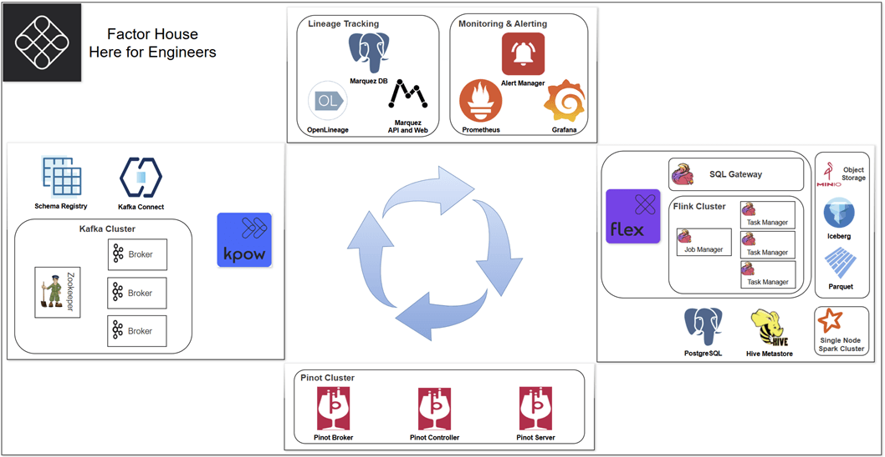

# Factor House Local



## Introduction

We provide several pre-configured Docker Compose environments to showcase different data platform setups. The summaries below offer a quick overview of each:

<details>

<summary><b>Kafka Development & Monitoring Stack with Kpow</b></summary>

<br>

This stack provides a complete **Apache Kafka development and monitoring environment**, built using Confluent Platform components and enhanced with [**Kpow**](https://factorhouse.io/kpow) for enterprise-grade observability and management. It includes a 3-node Kafka cluster, Zookeeper, Schema Registry, Kafka Connect, and Kpow itself.

### 📌 Description

This architecture is designed for developers and operations teams who need a **robust, local Kafka ecosystem** for building, testing, and managing Kafka-based applications. It features high availability (3 brokers), schema management for data governance, a data integration framework (Kafka Connect), and a powerful UI (Kpow) for monitoring cluster health, inspecting data, managing topics, and troubleshooting.

It's ideal for scenarios involving **event-driven architectures, microservices communication, data integration pipelines**, and situations requiring deep visibility into Kafka internals.

---

### 🔑 Key Components

#### 🚀 Kpow (Kafka Management & Monitoring Toolkit)

- Container: `factorhouse/kpow:latest`
- Provides a rich web UI for comprehensive Kafka monitoring, management, and data inspection. Features include:
  - **Real-time cluster/broker/topic metrics**
  - **Consumer lag monitoring**
  - **Data browse/search capabilities**
  - **Schema Registry integration**
  - **Kafka Connect cluster management**
  - **RBAC + JAAS** support via volume mounts
  - Trial license support via `env_file`
- Exposes UI at `http://localhost:3000`

#### 🧠 Kafka Cluster (3 Brokers + Zookeeper)

- **Zookeeper (`confluentinc/cp-zookeeper:7.8.0`)**: Coordinates the Kafka brokers.
- **Kafka Brokers (`confluentinc/cp-kafka:7.8.0` x3)**: Form the core message bus.
  - Configured with distinct internal (`1909x`) and external (`909x`) listeners for docker networking.
  - Provides basic fault tolerance with 3 nodes.
  - Accessible externally via ports `9092`, `9093`, `9094`.

#### 📜 Schema Registry (`confluentinc/cp-schema-registry:7.8.0`)

- Manages schemas (Avro, Protobuf, JSON Schema) for Kafka topics, ensuring data consistency and enabling schema evolution.
- Accessible at `http://localhost:8081`.
- Configured with Basic Authentication (`schema_jaas.conf`).
- Stores its schemas within the Kafka cluster itself.

#### 🔌 Kafka Connect (`confluentinc/cp-kafka-connect:7.8.0`)

- Framework for reliably streaming data between Apache Kafka and other systems.
- Accessible via REST API at `http://localhost:8083`.
- Configured to use JSON converters by default.
- **Custom Connector Support**: Volume mount `./resources/kpow/connector` allows adding custom or third-party connectors (e.g., JDBC, S3, Iceberg - hinted by `AWS_REGION`).
- Manages its configuration, offsets, and status in dedicated Kafka topics.

---

### 🧰 Use Cases

#### Local Kafka Development & Testing

- Build and test Kafka producers, consumers, and Kafka Streams applications against a realistic, multi-broker cluster.
- Validate application behavior during broker failures (by stopping/starting broker containers).

#### Data Integration Pipelines

- Utilize Kafka Connect to ingest data into Kafka from databases, logs, or APIs using source connectors.
- Stream data out of Kafka to data lakes (S3, Iceberg), warehouses, or other systems using sink connectors.
- Test and manage connector configurations via the Connect REST API or Kpow UI.

#### Schema Management & Evolution

- Define, register, and evolve schemas using Schema Registry to enforce data contracts between producers and consumers.
- Test compatibility modes and prevent breaking changes in data pipelines.

#### Real-Time Monitoring & Operations Simulation

- Use Kpow to monitor cluster health, track topic/partition metrics (size, throughput), identify consumer lag, and inspect messages in real-time.
- Understand Kafka performance characteristics and troubleshoot issues within a controlled environment.

#### Learning & Exploring Kafka

- Provides a self-contained environment to learn Kafka concepts, experiment with configurations, and explore the capabilities of the Confluent Platform and Kpow.

</details>

<details>

<summary><b>Real-Time Stream Analytics Stack with Flink + Flex</b></summary>

<br>

This stack provides a high-performance **streaming analytics platform** built around Apache Flink, designed for **real-time data processing, enrichment, joins**, and SQL-based interactions. It includes [**Flex**](https://factorhouse.io/flex) (a secure, enterprise-enhanced Flink layer), Flink JobManager/TaskManagers, and an interactive **SQL Gateway**.

### 📌 Description

This architecture is built to support **streaming-first workloads**—ideal for scenarios where **low latency**, **event-time processing**, and **complex data enrichment** are required. With Flex, it brings RBAC, SQL gateway access, and plug-and-play stream processing.

It is designed for use cases that go beyond traditional batch or lakehouse processing—especially suited for **operational intelligence, fraud detection, observability, and real-time metrics pipelines**.

---

### 🔑 Key Components

#### 🚀 Flex (Enterprise Flink Runtime)

- Container: `factorhouse/flex:latest`
- Enhanced Flink SQL gateway with support for:
  - **RBAC + JAAS**
  - Pre-configured connector mounts
  - Trial license support via `env_file`
- Exposes UI at `http://localhost:3001`

#### 🧠 Flink Cluster

- **JobManager** coordinates all tasks, handles scheduling, checkpoints, and failover.
  - Healthcheck verifies `/config` for readiness.
  - Volume mounts for custom Flink config and SQL defaults.
- **TaskManagers (3 nodes)** run user code and perform actual stream processing.
  - Horizontally scalable.
  - Connected to the same config and connector volumes as the JobManager.

#### 🛠 SQL Gateway

- REST-accessible endpoint (`http://localhost:9090`) for **interactive Flink SQL queries**.
- Allows:
  - Creating, updating, querying tables using Flink SQL
  - Querying Iceberg, Kafka, JDBC, and custom connectors
- Configured to run in the foreground for easier debugging.

---

### 🧰 Use Cases

#### Real-Time ETL & Stream Enrichment

- Ingest data from Kafka or other connectors.
- Join with lookup data (e.g., Redis, JDBC) in real time.
- Output to Iceberg, S3, PostgreSQL, or other sinks.

#### Event-Driven Analytics

- Detect patterns using **event-time windows**, **session clustering**, or **CEP (Complex Event Processing)**.
- Generate metrics and insights instantly on live data.

#### Self-Service SQL on Streaming Data

- Use SQL Gateway to empower analysts to query streaming datasets without needing deep Flink knowledge.
- Supports materialized views, table functions, and views over dynamic data.

#### Real-Time Data Lake Writes

- Use Flink’s native Iceberg integration to write out structured, evolving tables in real time.
- Lakehouse-friendly, works well with batch processors (e.g., Spark) downstream.

</details>

<details>

<summary><b>Analytics & Lakehouse Stack: Spark, Iceberg, MinIO & Postgres</b></summary>

<br>

This stack provides a self-contained environment for **modern data lakehouse analytics** using Apache Spark, Apache Iceberg, MinIO (S3-compatible object storage), and PostgreSQL. It features an Iceberg REST Catalog for centralized metadata management.

### 📌 Description

This architecture enables building and querying **data lakehouses**, where data is stored in an open format (Iceberg) on object storage (MinIO), offering ACID transactions, schema evolution, and time travel capabilities, while leveraging the powerful distributed processing engine of Apache Spark. The included PostgreSQL database can serve as a source/sink for relational data or potentially for Change Data Capture (CDC) scenarios.

It's ideal for **batch ETL/ELT, interactive data exploration via notebooks, and building reliable, scalable data analytics pipelines** on structured and semi-structured data.

---

### 🔑 Key Components

#### 🚀 Spark + Iceberg Compute Engine

- Container: `tabular/spark-iceberg:3.5.5_1.8.1` (`spark-iceberg`)
- Provides an **Apache Spark** environment pre-configured with **Apache Iceberg** support.
- Includes **Jupyter Notebook server** for interactive analytics (`http://localhost:8888`).
- **Spark Web UI** for monitoring jobs (`http://localhost:8080`).
- Configured via `spark-defaults.conf` to connect to the Iceberg REST catalog (`rest:8181`) and use MinIO as the S3 backend.
- Environment variables provide AWS credentials (`admin`/`password`) for MinIO access.

#### 📚 Iceberg REST Catalog

- Container: `apache/iceberg-rest-fixture` (`iceberg-rest`)
- A dedicated **REST service for managing Iceberg table metadata**.
- Allows multiple engines (like the Spark service here) to interact with the same Iceberg tables consistently.
- Configured to use MinIO (`http://minio:9000`) as the storage backend for the warehouse path `s3://warehouse/`.
- Accessible internally at `http://rest:8181`.

#### 💾 S3-Compatible Object Storage (MinIO)

- Container: `minio/minio` (`minio`)
- Provides **S3-compatible object storage**, acting as the data lake storage layer for Iceberg tables.
- **MinIO API** accessible at `http://localhost:9000`.
- **MinIO Console UI** accessible at `http://localhost:9001` (Credentials: `admin`/`password`).
- Initialized by the `mc` service.

#### 🛠 MinIO Client (Initialization)

- Container: `minio/mc` (`mc`)
- Utility container that runs once to:
  - Wait for MinIO to be ready.
  - Configure the MinIO client (`mc`) to connect to the `minio` service.
  - **Create necessary buckets** (`warehouse` for Iceberg, `factorhouse` for general use) and set public access policies.

#### 🐘 Relational Database (PostgreSQL)

- Container: `postgres:17` (`postgres`)
- Standard **PostgreSQL database**.
- Accessible at `localhost:5432` (Credentials: `db_user`/`db_password`, Database: `factorhouse`).
- **`wal_level=logical`**: This setting is enabled, suggesting potential use cases involving **Change Data Capture (CDC)**, allowing changes in Postgres tables to be streamed out.
- Includes volume mount for initialization scripts (`./resources/analytics/postgres`), allowing pre-loading of schemas or data.

---

### 🧰 Use Cases

#### Data Lakehouse Implementation

- Create, manage, and query Iceberg tables stored in MinIO using Spark SQL or DataFrame API via Jupyter notebooks.
- Perform ACID-compliant operations (INSERT, UPDATE, DELETE, MERGE) on large datasets.
- Leverage Iceberg features like schema evolution, partitioning, and time travel/version rollback.

#### Batch ETL/ELT Pipelines

- Ingest data from various sources (including Postgres), process/transform it using Spark, and load it into Iceberg tables in the lakehouse.
- Read data from Iceberg tables for downstream processing or reporting.

#### Interactive Data Analysis & Exploration

- Connect to the Jupyter server (`:8888`) to run Spark code (PySpark, Spark SQL) interactively against data stored in MinIO/Iceberg or the Postgres database.
- Visualize results directly within notebooks.

#### Change Data Capture (CDC) Foundation

- The Postgres `wal_level=logical` setup enables capturing row-level changes. While a CDC tool (like Debezium via Kafka Connect, or a Spark connector) isn't included _in this stack_, the database is ready for such integration, allowing changes from Postgres to be ingested into the Iceberg lakehouse in near real-time.

#### Development & Testing Environment

- Provides a local, integrated environment for developing and testing Spark applications that interact with Iceberg tables, S3 storage, and a relational database.

</details>

<details>

<summary><b>Apache Pinot Real-Time OLAP Cluster</b></summary>

<br>

This stack deploys a basic **Apache Pinot** cluster, a real-time distributed **OLAP (Online Analytical Processing)** datastore designed for **ultra-low-latency analytics** at scale. It includes the core Pinot components: Controller, Broker, and Server.

### 📌 Description

This architecture provides the foundation for ingesting data from batch (e.g., HDFS, S3) or streaming sources (e.g., Kafka) and making it available for analytical queries with response times often in milliseconds. Pinot is optimized for user-facing analytics, real-time dashboards, anomaly detection, and other scenarios requiring fast insights on fresh data.

**Note:** This configuration requires an external Apache Zookeeper instance running at `zookeeper:2181` on the `factorhouse` network for cluster coordination, which is not defined within this specific file.

---

### 🔑 Key Components

#### 👑 Pinot Controller (`pinot-controller`)

- Container: `apachepinot/pinot:1.2.0`
- Role: Manages the overall cluster state, handles administration tasks (like adding tables, schema management), coordinates segment assignment, and monitors node health via Zookeeper.
- **Admin UI/API**: Exposed externally at `http://localhost:19000` (maps to internal port 9000).
- Healthcheck verifies its readiness.

#### 📡 Pinot Broker (`pinot-broker`)

- Container: `apachepinot/pinot:1.2.0`
- Role: Acts as the query gateway. Receives SQL queries from clients, determines which servers hold the relevant data segments, scatters the query to those servers, gathers the results, and returns the final consolidated response.
- **Query Endpoint**: Exposed externally at `http://localhost:18099` (maps to internal port 8099).
- Depends on the Controller being healthy before starting.
- Healthcheck verifies its readiness.

#### 💾 Pinot Server (`pinot-server`)

- Container: `apachepinot/pinot:1.2.0`
- Role: Hosts data segments (shards) and executes query fragments against the data it stores. Can ingest data directly from streaming sources (Realtime Server) or load pre-built segments from deep storage (Offline Server). This configuration runs a generic Server capable of both roles depending on table setup.
- **Internal API/Metrics**: Exposed externally at `http://localhost:18098` (maps to internal port 8098/8097 for health). Direct interaction is less common than with the Broker or Controller.
- Depends on the Broker being healthy before starting.
- Healthcheck verifies its readiness.

#### 🌐 Network & Dependencies

- All components reside on the `factorhouse` network.
- Relies on an **external Zookeeper** instance at `zookeeper:2181` for coordination.
- Startup order is enforced via `depends_on` and `healthcheck` conditions: Controller -> Broker -> Server.

---

### 🧰 Use Cases

#### Real-Time Dashboards

- Power interactive dashboards requiring millisecond query latency on potentially large, constantly updating datasets (e.g., operational monitoring, business intelligence).

#### User-Facing Analytics

- Embed analytics directly into applications where users can explore data slices and dices with immediate feedback (e.g., e-commerce site analytics, personalized recommendations).

#### Anomaly & Threat Detection

- Query streaming event data in near real-time to identify patterns, outliers, or anomalies quickly (e.g., fraud detection, system security monitoring).

#### A/B Testing Analysis

- Ingest experiment data and provide rapid aggregations and comparisons to evaluate A/B test performance.

#### Log Analytics

- Provide fast, interactive querying over large volumes of log or event data for troubleshooting and analysis.

</details>

---

## Prerequisites

### Install Docker

The local cluster runs with Docker Compose, so you will need to [install Docker](https://www.docker.com/).

Once Docker is installed, clone this repository and run the following commands from the base path.

### Clone this repository

```
git clone git@github.com:factorhouse/factorhouse-local.git
```

### Change into the repository directory

```
cd factorhouse-local
```

### Download Kafka and Flink Connectors

The Following Connectors are downloaded and made available.

- **Kafka**
  - [Confulent S3 Sink Connector](https://docs.confluent.io/kafka-connectors/s3-sink/current/overview.html)
  - [Debezium connector for PostgreSQL](https://debezium.io/documentation/reference/stable/connectors/postgresql.html)
  - [Apache Iceberg Sink Connector](https://github.com/databricks/iceberg-kafka-connect)
  - [Amazon MSK Data Generator](https://github.com/awslabs/amazon-msk-data-generator)
- **Flink**
  - [Apache Kafka SQL Connector](https://nightlies.apache.org/flink/flink-docs-release-1.20/docs/connectors/table/kafka/)
  - [Flink Facker Connector](https://github.com/knaufk/flink-faker)

```bash
./resources/setup-env.sh

# downloading kafka connectors ...
# downloading flink connectors ...
```

### Update Kpow and Flex Licenses

For managing Kpow and Flex licenses effectively, it's strongly recommended to store the license files **externally** from your main configuration or version control system (like Git). This approach prevents accidental exposure of sensitive license details and makes updating or swapping licenses much simpler.

The Docker Compose files facilitates this by allowing you to specify the path to your license file using **environment variables** on your host machine _before_ launching the services. Specifically, they are configured to look for these variables and use their values to locate the appropriate license file via the `env_file` directive. If an environment variable is not set, a default path (usually within the `resources` directory) is used as a fallback.

The specific environment variables used are:

- **`KPOW_TRIAL_LICENSE`**: Specifies the path to the Kpow Enterprise Trial license file.
- **`KPOW_COMMUNITY_LICENSE`**: Specifies the path to the Kpow Community license file.
- **`FLEX_TRIAL_LICENSE`**: Specifies the path to the Flex Trial license file.
- **`FLEX_COMMUNITY_LICENSE`**: Specifies the path to the Flex Community license file.

**Example Usage:**

Imagine your Kpow Community license is stored at `/opt/licenses/kpow-community.env`. To instruct Docker Compose to use this specific file, you would set the environment variable on your host _before_ running the compose command:

```bash
# Set the environment variable (syntax may vary slightly depending on your shell)
export KPOW_COMMUNITY_LICENSE=/opt/licenses/kpow-community.env

# Now run Docker Compose - it will use the path set above
docker compose -p kpow -f compose-kpow-community.yml up -d
```

<details>

<summary>License file example</summary>

```
### Your License Details
LICENSE_ID=<license-id>
LICENSE_CODE=<license-code>
LICENSEE=<licensee>
LICENSE_EXPIRY=<license-expiry>
LICENSE_SIGNATURE=<license-signature>
```

</details>

<details>

<summary>License mapping details</summary>

```yaml
# compose-kpow-trial.yml
services:
  kpow:
    ...
    env_file:
      - resources/kpow/config/trial.env
      - ${KPOW_TRIAL_LICENSE:-resources/kpow/config/trial-license.env}

# compose-kpow-community.yml

services:
kpow:
...
env_file: - resources/kpow/config/community.env - ${KPOW_COMMUNITY_LICENSE:-resources/kpow/config/community-license.env}

# compose-flex-trial.yml

services:
flex:
...
env_file: - resources/flex/config/trial.env - ${FLEX_TRIAL_LICENSE:-resources/flex/config/trial-license.env}

# compose-flex-trial.yml

services:
flex:
...
env_file: - resources/flex/config/local-community.env - ${KPOW_COMMUNITY_LICENSE:-resources/flex/config/community-license.env}
```

</details>

## Start Resources

There are two primary methods for launching the various Docker Compose stacks (Kpow, Flex, Analytics, Pinot).

- The first method launches all stacks sequentially as an integrated system, offering variants for either **Kpow Enterprise (Trial)** (`compose-kpow-trial.yml`) or **Kpow Community** (`compose-kpow-community.yml`) as the initial component. It uses the `&&` operator to ensure the Kpow stack starts first, which is important becuse it is responsible for creating the shared `factorhouse` Docker network used by the other services. Note that this integrated approach employs the `-p <project_name>` flag for each `docker compose` command (e.g., `-p kpow`, `-p flex`) to assign distinct project names. This prevents potential conflicts and "orphan container" warnings that can occur when Docker Compose manages multiple configurations from the same directory, ensuring each stack is managed as a separate entity while sharing the network.
- The second method demonstrates starting services individually. Kpow (Trial or Community) can be launched standalone. To start Flex or Analytics independently (perhaps for isolated testing), the `USE_EXT=false` environment variable should be prepended to their respective commands. This overrides their default network configuration (defined as `external: ${USE_EXT:-true}` within their Compose files), forcing them to create its own Docker network. Note that the Pinot stack cannot be started in this isolated fashion because its configuration explicitly depends on the Zookeeper service provided by the Kpow stack, requiring them to be on the same network.

```bash
## Method 1
# Kpow Enterprise
docker compose -p kpow -f compose-kpow-trial.yml up -d \
  && docker compose -p flex -f compose-flex-trial.yml up -d \
  && docker compose -p analytics -f compose-analytics.yml up -d \
  && docker compose -p pinot -f compose-pinot.yml up -d

# Kpow Community
docker compose -p kpow -f compose-kpow-community.yml up -d \
  && docker compose -p flex -f compose-flex-trial.yml up -d \
  && docker compose -p analytics -f compose-analytics.yml up -d \
  && docker compose -p pinot -f compose-pinot.yml up -d

## Method 2
# Kpow Enterprise
docker compose -f compose-kpow-trial.yml up -d
# Kpow Community
docker compose -f compose-kpow-trial.yml up -d

USE_EXT=false docker compose -f compose-flex-trial.yml up -d
USE_EXT=false docker compose -p analytics -f compose-analytics.yml up -d
# Pinot cannot be started on its own because it depends on the Zookeeper service in the Kpow stack
```

## Stop/Remove Resources

Likewise, there are two methods for stopping and removing the containers and Docker networks.

- The first method handles the teardown of the **entire integrated system**. It uses `docker compose down` sequentially for each stack, specifying the corresponding `-p <project_name>` flag used during startup (e.g., `-p pinot`, `-p analytics`) to ensure the correct set of resources is targeted. The order is reversed compared to startup, with the Kpow stack (Trial or Community) being brought down _last_. This is necessary because the Kpow stack creates the shared `factorhouse` network, and removing it last allows other services to cleanly detach before the network is removed.
- The second method addresses stopping **individual services** that might have been started in isolation. Kpow (Trial or Community) is stopped using a simple `docker compose down`. For Flex and Analytics, if they were started independently using `USE_EXT=false`, the same `USE_EXT=false` environment variable _must_ be prepended to the `docker compose down` command. This ensures Docker Compose correctly identifies and removes the _isolated_ network that was created specifically for that stack during its isolated startup.

```bash
## Method 1
# Kpow Enterprise
docker compose -p pinot -f compose-pinot.yml down \
  && docker compose -p analytics -f compose-analytics.yml down \
  && docker compose -p flex -f compose-flex-trial.yml down \
  && docker compose -p kpow -f compose-kpow-trial.yml down

# Kpow Community
docker compose -p pinot -f compose-pinot.yml down \
  && docker compose -p analytics -f compose-analytics.yml down \
  && docker compose -p flex -f compose-flex-trial.yml down \
  && docker compose -p kpow -f compose-kpow-community.yml down

## Method 2
# Kpow Enterprise
docker compose -f compose-kpow-trial.yml down
# Kpow Community
docker compose -f compose-kpow-community.yml down

USE_EXT=false docker compose -f compose-flex-trial.yml down
USE_EXT=false docker compose -p analytics -f compose-analytics.yml down
```

## QuickStart Examples

1. [Kafka Iceberg Sink](./quickstart/kafka-iceberg-sink.md)  
   Streams data from Kafka into an Apache Iceberg table stored in MinIO. Topics are created, an Iceberg table is defined via Spark SQL, and the Iceberg Sink Connector is deployed and monitored using **Kpow**. Ingested records are validated in the MinIO-backed Iceberg table.

2. [Flink SQL Client](./quickstart/flink-sql-client.md)  
   Uses the [Flink Faker](https://github.com/knaufk/flink-faker) connector to simulate streaming data with randomized fields. Demonstrates creating a mock `orders` table and running a tumbling window Top-N query to identify top suppliers, showcasing real-time Flink SQL analytics.

3. [Flink SQL Gateway](./quickstart/flink_sql_gateway.py)  
   A Python script that interacts with Flink SQL Gateway via REST API using `urllib3`. It automates session handling, statement submission (e.g., with `datagen`), and paginated result fetching, enabling programmatic control over Flink SQL.

4. [Flink Parquet Sink](./quickstart/flink-sql-sink-parquet.md)  
   Shows how to write streaming data to Parquet files in MinIO using Flink SQL. Synthetic data is generated via Flink Faker, partitioned by time, and stored using the filesystem connector. Checkpointing ensures reliability; results are visualized with **Flex**.

5. [Flink Iceberg Sink](./quickstart/flink-sql-sink-iceberg.md)  
   Demonstrates setting up an Iceberg catalog on MinIO and creating a Parquet-backed `db.users` table. Sample records are inserted and queried via Flink SQL, validating the use of Iceberg as a Flink table sink with S3-compatible storage.

6. [Spark SQL Iceberg](./quickstart/spark-sql-iceberg.md)  
   Illustrates using Spark SQL with an Iceberg catalog. After verifying the `demo` catalog, a `db.users` table is created and queried, confirming successful data insertion and storage in MinIO through Iceberg.

7. [Pinot Analytics](./quickstart/pinot-analytics.md)  
   Walks through table creation, batch ingestion, and analytical querying in Apache Pinot. A `baseballStats` table is set up using schema and config files, data is loaded via ingestion job, and queries are run to aggregate and display player stats.

## Port Mapping

### Kafka with Kpow Stack

| Service Name | Port(s) (Host:Container) | Description                                               |
| :----------- | :----------------------- | :-------------------------------------------------------- |
| `kpow`       | `3000:3000`              | Kpow (Web UI for Kafka monitoring and management)         |
| `schema`     | `8081:8081`              | Confluent Schema Registry (manages Kafka message schemas) |
| `connect`    | `8083:8083`              | Kafka Connect (framework for Kafka connectors)            |
| `zookeeper`  | `2181:2181`              | ZooKeeper (coordination service for Kafka)                |
| `kafka-1`    | `9092:9092`              | Kafka Broker 1 (message broker instance)                  |
| `kafka-2`    | `9093:9093`              | Kafka Broker 2 (message broker instance)                  |
| `kafka-3`    | `9094:9094`              | Kafka Broker 3 (message broker instance)                  |

### Flink with Flex Stack

| Service Name  | Port(s) (Host:Container) | Description                                                       |
| :------------ | :----------------------- | :---------------------------------------------------------------- |
| `flex`        | `3001:3000`              | Flex (Web UI for Flink management, using host port 3001)          |
| `jobmanager`  | `8082:8081`              | Apache Flink JobManager (coordinates Flink jobs, Web UI/REST API) |
| `sql-gateway` | `9090:9090`              | Apache Flink SQL Gateway (REST endpoint for SQL queries)          |

_(Note: `taskmanager-1`, `taskmanager-2`, `taskmanager-3` do not expose ports to the host)_

### Analytics & Lakehouse Stack

| Service Name    | Port(s) (Host:Container)                                     | Description                                                               |
| :-------------- | :----------------------------------------------------------- | :------------------------------------------------------------------------ |
| `spark-iceberg` | `8888:8888`,<br>`8080:8080`,<br>`10000:10000`, `10001:10001` | 8888: Jupyter Server<br>8080: Spark Web UI<br>10000/1 Spark Thrift Server |
| `rest`          | `8181:8181`                                                  | Apache Iceberg REST Catalog Service                                       |
| `minio`         | `9001:9001`, `9000:9000`                                     | MinIO S3 Object Storage (9000: API, 9001: Console UI)                     |
| `postgres`      | `5432:5432`                                                  | PostgreSQL Database Server                                                |

_(Note: `mc` does not expose ports to the host)_

### Apache Pinot Stack

| Service Name       | Port(s) (Host:Container) | Description                                                 |
| :----------------- | :----------------------- | :---------------------------------------------------------- |
| `pinot-controller` | `19000:9000`             | Apache Pinot Controller (manages cluster state, UI/API)     |
| `pinot-broker`     | `18099:8099`             | Apache Pinot Broker (handles query routing and results)     |
| `pinot-server`     | `18098:8098`             | Apache Pinot Server (hosts data segments, executes queries) |

## Dependency Configuration for Flink SQL Client and SQL Gateway

The `factorhouse/flink` Docker image comes pre-packaged with essential JAR dependencies required for interacting with Hadoop filesystems (HDFS, S3A, etc.), processing Parquet files, and managing Apache Iceberg tables. However, by default, the Flink SQL Client and SQL Gateway services only automatically load JARs located directly within the standard `/opt/flink/lib` directory.

Since the necessary Hadoop, Parquet, and Iceberg JARs are intentionally placed in dedicated directories within the image (e.g., `/tmp/hadoop/`, `/tmp/iceberg/`, `/tmp/parquet/`), they are **not included** in the default classpath of these services. To ensure these critical dependencies are correctly loaded at runtime for use by the SQL Client and Gateway, you **must** configure the following environment variable:

- `CUSTOM_JARS_DIRS="/tmp/hadoop;/tmp/iceberg;/tmp/parquet"`

Setting `CUSTOM_JARS_DIRS` instructs Flink to scan these additional specified directories and load any JAR files found within them, thereby making the required classes available for SQL operations involving these technologies. Without this environment variable explicitly set, only the core Flink JARs residing in `/opt/flink/lib` are loaded, and attempts to use Hadoop, Parquet, or Iceberg connectors and formats via SQL would likely result in `ClassNotFound` or orther related errors.

Note that this environment variable is configured by default. If you intend to submit with your own application (as a Uber fat jar), comment it out in all Flink services (JobManager, TaskManager, and optionally SQL Gateway).

**Without CUSTOM_JARS_DIRS**

```log
Starting Job Manager
Classpath Output:
/opt/flink/lib/flink-cep-1.20.1.jar:/opt/flink/lib/flink-connector-files-1.20.1.jar:/opt/flink/lib/flink-csv-1.20.1.jar:/opt/flink/lib/flink-json-1.20.1.jar:/opt/flink/lib/flink-scala_2.12-1.20.1.jar:/opt/flink/lib/flink-table-api-java-uber-1.20.1.jar:/opt/flink/lib/flink-table-planner-loader-1.20.1.jar:/opt/flink/lib/flink-table-runtime-1.20.1.jar:/opt/flink/lib/log4j-1.2-api-2.17.1.jar:/opt/flink/lib/log4j-api-2.17.1.jar:/opt/flink/lib/log4j-core-2.17.1.jar:/opt/flink/lib/log4j-slf4j-impl-2.17.1.jar:/opt/flink/lib/flink-dist-1.20.1.jar
```

**With CUSTOM_JARS_DIRS**

```log
Starting Job Manager
[INFO] Added custom JARs from /tmp/hadoop
[INFO] Added custom JARs from /tmp/iceberg
[INFO] Added custom JARs from /tmp/parquet
Classpath Output:
/opt/flink/lib/flink-cep-1.20.1.jar:/opt/flink/lib/flink-connector-files-1.20.1.jar:/opt/flink/lib/flink-csv-1.20.1.jar:/opt/flink/lib/flink-json-1.20.1.jar:/opt/flink/lib/flink-scala_2.12-1.20.1.jar:/opt/flink/lib/flink-table-api-java-uber-1.20.1.jar:/opt/flink/lib/flink-table-planner-loader-1.20.1.jar:/opt/flink/lib/flink-table-runtime-1.20.1.jar:/opt/flink/lib/log4j-1.2-api-2.17.1.jar:/opt/flink/lib/log4j-api-2.17.1.jar:/opt/flink/lib/log4j-core-2.17.1.jar:/opt/flink/lib/log4j-slf4j-impl-2.17.1.jar:/tmp/hadoop/stax2-api-4.2.1.jar:/tmp/hadoop/hadoop-shaded-guava-1.1.1.jar:/tmp/hadoop/aws-java-sdk-bundle-1.11.1026.jar:/tmp/hadoop/commons-configuration2-2.8.0.jar:/tmp/hadoop/hadoop-auth-3.3.6.jar:/tmp/hadoop/hadoop-mapreduce-client-core-3.3.6.jar:/tmp/hadoop/woodstox-core-6.5.1.jar:/tmp/hadoop/hadoop-aws-3.3.6.jar:/tmp/hadoop/hadoop-common-3.3.6.jar:/tmp/hadoop/hadoop-hdfs-client-3.3.6.jar:/tmp/iceberg/iceberg-aws-bundle-1.8.1.jar:/tmp/iceberg/iceberg-flink-runtime-1.20-1.8.1.jar:/tmp/parquet/flink-sql-parquet-1.20.1.jar:/opt/flink/lib/flink-dist-1.20.1.jar
```
