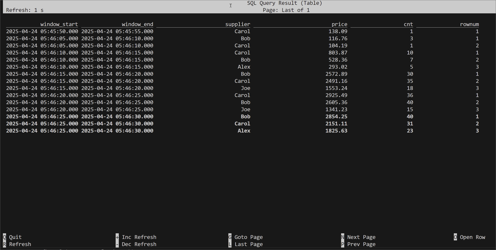

## SQL Client Example

### Start SQL Client

```bash
docker exec -it jobmanager ./bin/sql-client.sh
```

### Add the Flink Faker Connector

```SQL
-- // Add JAR
ADD JAR 'file:///tmp/connector/flink-faker-0.5.3.jar';
-- [INFO] Execute statement succeeded.

SHOW JARS;
-- +--------------------------------------+
-- |                                 jars |
-- +--------------------------------------+
-- | /tmp/connector/flink-faker-0.5.3.jar |
-- +--------------------------------------+
-- 1 row in set
```

### Create a Table

```sql
CREATE TABLE orders (
    bid_time TIMESTAMP(3),
    price DOUBLE,
    item STRING,
    supplier STRING,
    WATERMARK FOR bid_time AS bid_time - INTERVAL '5' SECONDS
) WITH (
  'connector' = 'faker',
  'fields.bid_time.expression' = '#{date.past ''30'',''SECONDS''}',
  'fields.price.expression' = '#{Number.randomDouble ''2'',''1'',''150''}',
  'fields.item.expression' = '#{Commerce.productName}',
  'fields.supplier.expression' = '#{regexify ''(Alice|Bob|Carol|Alex|Joe|James|Jane|Jack)''}',
  'rows-per-second' = '100'
);
-- [INFO] Execute statement succeeded.

SHOW TABLES;
-- +------------+
-- | table name |
-- +------------+
-- |     orders |
-- +------------+
-- 1 row in set
```

### Run a Window Top-N query

This [example](https://github.com/ververica/flink-sql-cookbook/blob/main/aggregations-and-analytics/11_window_top_n/11_window_top_n.md) shows how to calculate the Top 3 suppliers who have the highest sales for every tumbling 5 seconds window.

```sql
SELECT *
    FROM (
        SELECT *, ROW_NUMBER() OVER (PARTITION BY window_start, window_end ORDER BY price DESC) as rownum
        FROM (
            SELECT window_start, window_end, supplier, ROUND(SUM(price), 2) as price, COUNT(*) as cnt
            FROM TABLE(
                TUMBLE(TABLE orders, DESCRIPTOR(bid_time), INTERVAL '5' SECONDS))
            GROUP BY window_start, window_end, supplier
        )
    ) WHERE rownum <= 3;
```


