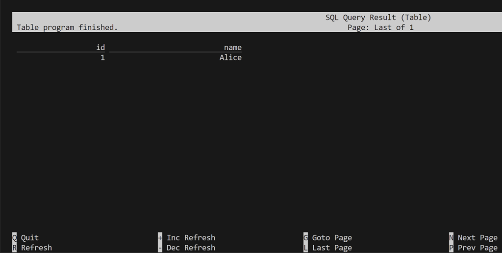
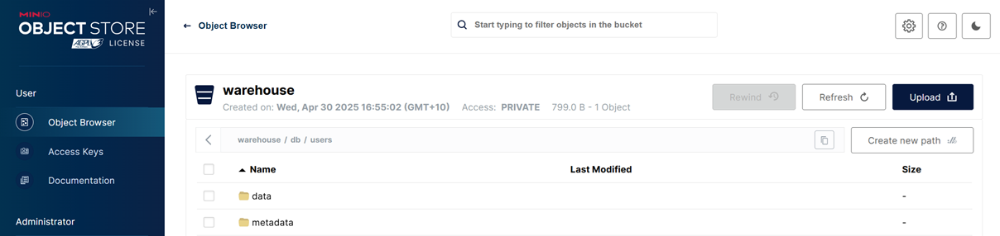

## Flink SQL Iceberg Example

### Start SQL Client

```bash
docker exec -it jobmanager ./bin/sql-client.sh
```

### Create a Catalog

```sql
SET 'execution.runtime-mode' = 'batch';

CREATE CATALOG demo WITH (
    'type' = 'iceberg',
    'catalog-type' = 'rest',
    'uri' = 'http://rest:8181',
    'io-impl' = 'org.apache.iceberg.aws.s3.S3FileIO',
    's3.endpoint' = 'http://minio:9000',
    's3.path-style-access' = 'true',
    's3.access-key-id' = 'admin',
    's3.secret-access-key' = 'password'
);
```

### Create table and insert records

```sql
USE catalog demo;
-- SHOW CURRENT CATALOG;

DROP TABLE IF EXISTS db.users;

CREATE TABLE db.users (
    id BIGINT,
    name STRING
) WITH (
    's3.endpoint' = 'http://minio:9000',
    's3.path-style-access' = 'true',
    's3.access-key-id' = 'admin',
    's3.secret-access-key' = 'password',
    'write.format.default' = 'parquet'
);

INSERT INTO db.users VALUES (1, 'Alice');
SELECT * FROM db.users;
```

The query result is shown on terminal.



Also, check the iceberg table on MinIO.


