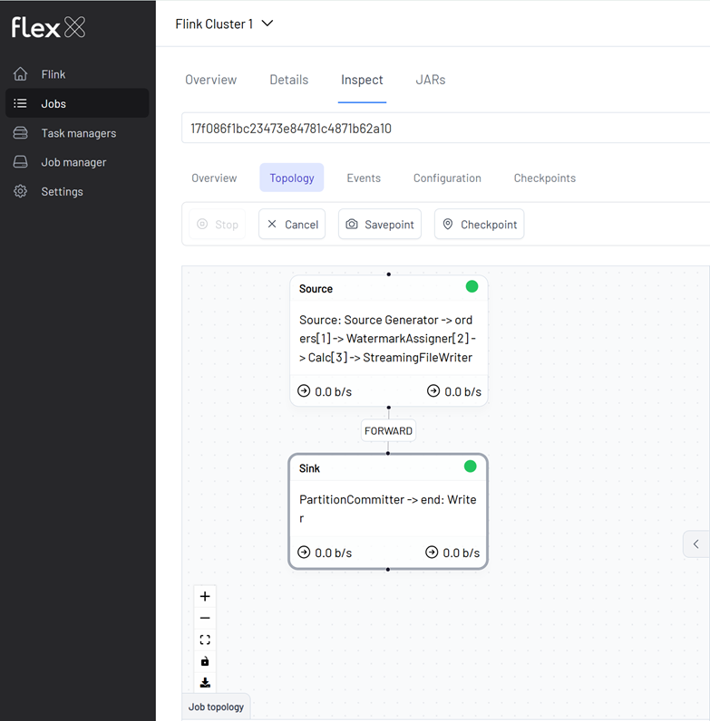
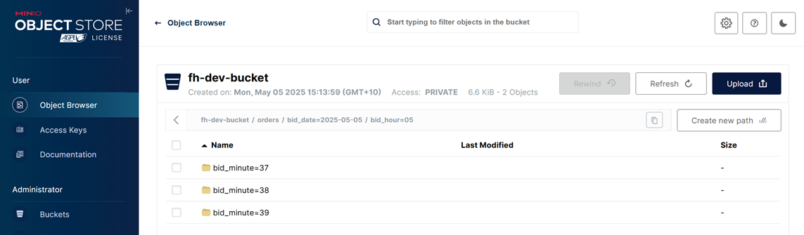

## Flink SQL Parquet Example

### Start SQL Client

```bash
docker exec -it jobmanager ./bin/sql-client.sh
```

### Create a Source Table

```sql
ADD JAR 'file:///tmp/connector/flink-faker-0.5.3.jar';
-- SHOW JARS;

CREATE TABLE orders (
    bid_time TIMESTAMP(3),
    price DOUBLE,
    item STRING,
    supplier STRING,
    WATERMARK FOR bid_time AS bid_time - INTERVAL '5' SECONDS
) WITH (
  'connector' = 'faker',
  'fields.bid_time.expression' = '#{date.past ''30'',''SECONDS''}',
  'fields.price.expression' = '#{Number.randomDouble ''2'',''1'',''150''}',
  'fields.item.expression' = '#{Commerce.productName}',
  'fields.supplier.expression' = '#{regexify ''(Alice|Bob|Carol|Alex|Joe|James|Jane|Jack)''}',
  'rows-per-second' = '10'
);
```

### Create a Sink Table and Insert into MinIO

```sql
--// Set checkpoint interval to 1 minute
SET 'execution.checkpointing.interval' = '60000';
-- --// Set the checkpointing mode (e.g., 'EXACTLY_ONCE')
-- SET 'execution.checkpointing.mode' = 'EXACTLY_ONCE';
-- --// Set checkpoint timeout to 50 seconds
-- SET 'execution.checkpointing.timeout' = '50000';
-- --// Minimum pause between checkpoints, e.g., 20 seconds
-- SET 'execution.checkpointing.min-pause' = '20000';

CREATE TABLE orders_sink(
    bid_date STRING,
    bid_hour STRING,
    bid_minute STRING,
    price DOUBLE,
    item STRING,
    supplier STRING
) PARTITIONED BY (bid_date, bid_hour, bid_minute) WITH (
    'connector' = 'filesystem',
    'path' = 's3a://factorhouse/orders/',
    'format' = 'parquet',
    'sink.partition-commit.delay' = '1 min',
    'sink.partition-commit.policy.kind' = 'success-file',
    'sink.rolling-policy.file-size' = '128 MB',
    'sink.rolling-policy.rollover-interval' = '15 min',
    'sink.rolling-policy.check-interval' = '1 min'
);

INSERT INTO orders_sink
SELECT
    DATE_FORMAT(bid_time, 'yyyy-MM-dd'),
    DATE_FORMAT(bid_time, 'HH'),
    DATE_FORMAT(bid_time, 'mm'),
    price,
    item,
    supplier
FROM orders;
```

### Flink Job on Flex



### Parquet Files on MinIO


