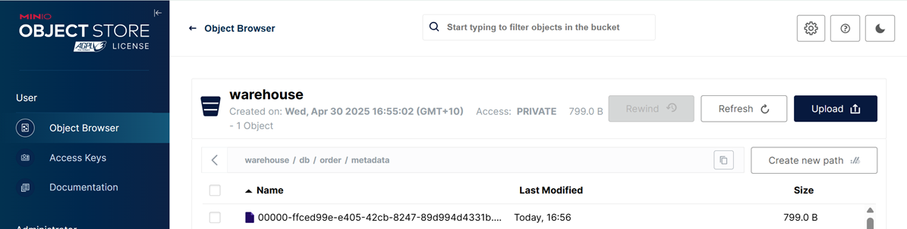
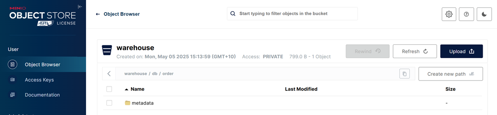

## Kafka Iceberg Sink Example

### Prerequisites

1. Create kafka topics using `kafka-msk-datagen.json`.
2. Create the target Iceberg table.

```bash
# start spark sql shell
docker exec -it spark-iceberg spark-sql
```

```sql
-- create the target iceberg table
CREATE TABLE db.order (
  quantity INT,
  product_id INT,
  customer_id STRING
)
USING iceberg;
```

Check the iceberg table on MinIO.



### Deploy Iceberg Sink Connector

- Use `kafka-iceberg-sink.json`

The sink connector can be shown on Kpow.


Also, the records are intested into MinIO.


