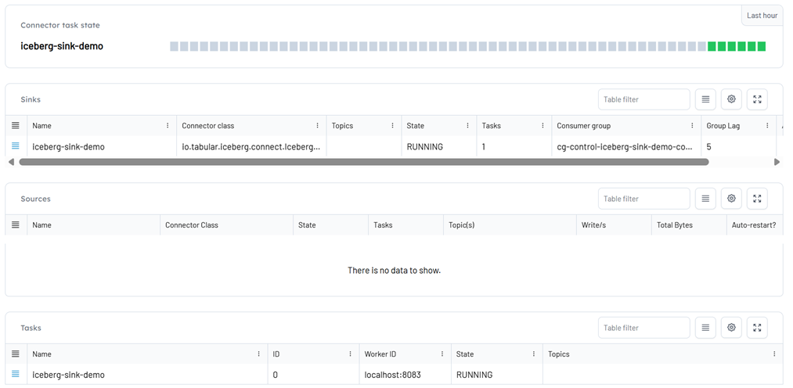
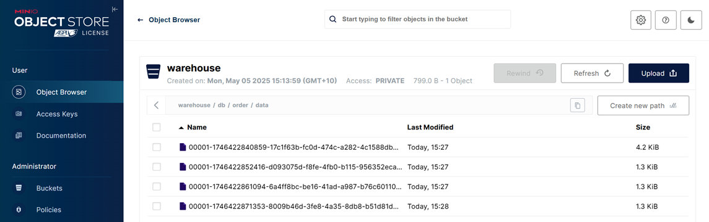

## Kafka Iceberg Sink Example

### Prerequisites

We'll use two Kafka connectors.

- MSK Data Generator
- Kafka Iceberg Sink Connector


1. Create kafka topics by importing [`kafka-msk-datagen.json`](./kafka-msk-datagen.json).


2. Create the target Iceberg table.

```bash
# start spark sql shell
docker exec -it spark-iceberg spark-sql
```

```sql
-- create the target iceberg table
CREATE TABLE db.order (
  quantity INT,
  product_id INT,
  customer_id STRING
)
USING iceberg;
```

Check the iceberg table on MinIO.


### Deploy Iceberg Sink Connector

- Similar to the source connector, the Iceberg sink connector can be created by importing [`kafka-iceberg-sink.json`](./kafka-iceberg-sink.json)

The sink connector can be shown on Kpow.



Also, the records are intested into MinIO.


