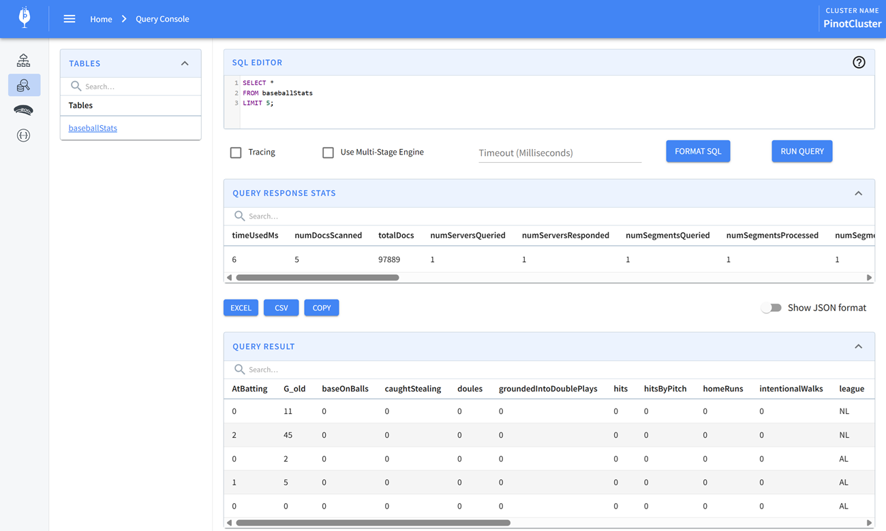
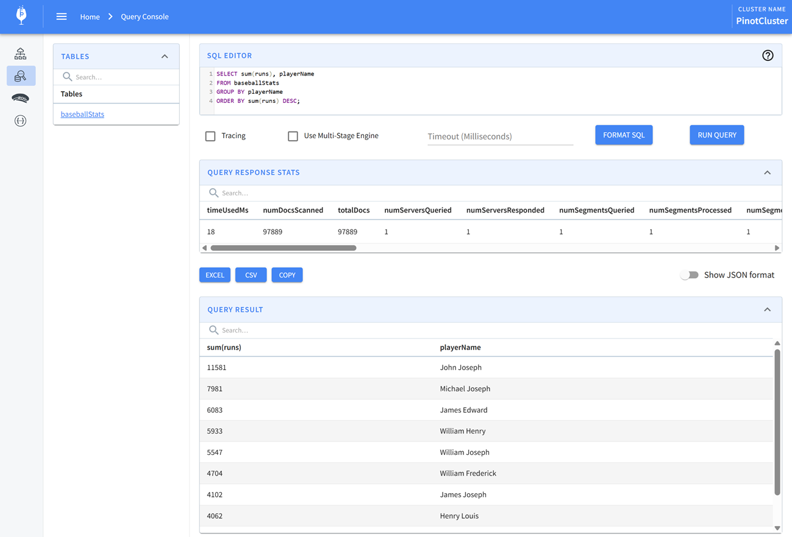

## Pinot Examples

### Create a table

```bash
docker exec -it pinot_controller /opt/pinot/bin/pinot-admin.sh AddTable \
  -schemaFile /opt/pinot/examples/batch/baseballStats/baseballStats_schema.json\
  -tableConfigFile /opt/pinot/examples/batch/baseballStats/baseballStats_offline_table_config.json -exec

# ...
# 2025/04/28 00:04:23.906 INFO [AddTableCommand] [main] {"unrecognizedProperties":{},"status":"TableConfigs baseballStats successfully added"}
```

### Insert records

```bash
docker exec -it pinot_controller /opt/pinot/bin/pinot-admin.sh LaunchDataIngestionJob \
  -jobSpecFile /opt/pinot/examples/batch/baseballStats/ingestionJobSpec.yaml
```

### Query records

```sql
SELECT *
FROM baseballStats
LIMIT 5;
```



```sql
SELECT sum(runs), playerName
FROM baseballStats
GROUP BY playerName
ORDER BY sum(runs) DESC;
```


