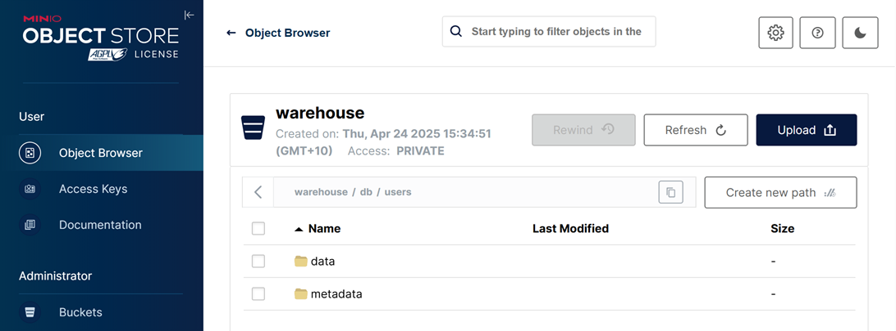

## Spark SQL Example

### Start Spark SQL

```bash
docker exec -it spark-iceberg spark-sql
```

### Check metadata

`demo` is the default catalog.

```sql
SHOW catalogs;
-- demo
-- spark_catalog
```

### Create table and insert records

```sql
CREATE TABLE db.users (id bigint, name string) USING iceberg;
INSERT INTO db.users VALUES (1, 'Alice');
SELECT * FROM db.users;
-- 1       Alice
```


